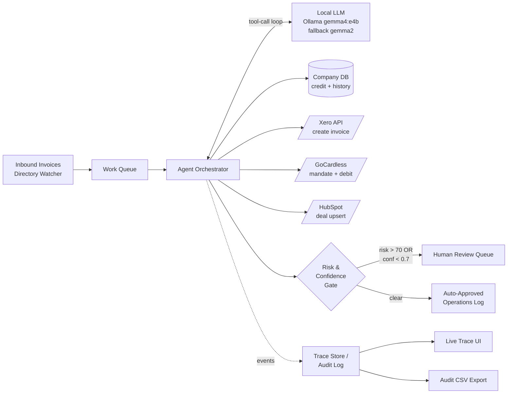

# OceanX AI OS — Autonomous Operations Demo

A working demo for the OceanX AI Automation Internship assignment — **Option 9: Multi-step mini-agent**. Drops a directory of inbound invoices in, agent autonomously runs each one through the full ops pipeline, humans only see what was escalated.

> "Humans only do relationships + capital decisions. Agents run everything else."

## What it does

For every invoice file dropped into the watcher, the agent runs a tool-use loop:

1. **`extractInvoice`** — LLM parses OCR text into canonical fields
2. **`lookupCompanyHistory`** — pulls counterparty payment history + credit flags from CompanyDB
3. **`scoreRisk`** — LLM combines invoice + history → `riskScore`, `confidence`, `reasoning`
4. **Routing gate** — if `risk > 70` OR `confidence < 0.7` OR critical credit flags → `escalateToHuman`; otherwise:
5. **`generateXeroInvoice`** — creates the AR invoice in Xero (mock API, real-shape JSON)
6. **`scheduleGoCardlessDebit`** — creates direct-debit mandate + schedules charge
7. **`updateHubSpotDeal`** — upserts the deal into the CRM with funded status
8. **`done`**

The LLM picks the next tool at each step — this is a real agent loop, not a fixed pipeline. Tool errors trigger retry/backoff (3 attempts, exponential); persistent failures escalate.

## Three things this demo showcases

1. **Multi-step tool-calling agent on a local LLM.** Hand-rolled tool-use loop driven by Ollama (`gemma4:e4b` primary, `gemma2` fallback) since Gemma doesn't natively support function calling. Tool definitions are JSON-schema-shaped — drop-in port to Anthropic tool-use or MCP.
2. **Live agent trace + observability.** Every prompt, response, tool call, retry, and latency appears in the **Live Trace** tab in real time. CSV audit export with one row per agent step.
3. **Mock integration layer with realistic payloads + injected failures.** Xero / GoCardless / HubSpot / CompanyDB return real-shape JSON modeled on production OpenAPI specs. The **Chaos Mode** toggle injects 30% Xero failure rate to demonstrate retry/backoff live.

## Architecture



### How this scales

| Today | Tomorrow |
|---|---|
| 1 React process, in-memory work queue | BullMQ/Redis with N orchestrator workers |
| In-memory trace store | Append-only log to S3/Postgres for SOC2/audit |
| Hand-rolled tool loop on Ollama | Drop-in swap to Anthropic tool-use (tool defs already JSON-schema-shaped) |
| 4 mock integrations | Each becomes its own MCP server; orchestrator unchanged |
| Single agent (ops) | Multi-agent (lead-gen → underwriting → ops → collections), all sharing one trace store |

## Running locally

```bash
# 1. Make sure Ollama is up with the right models
ollama pull gemma4:e4b   # primary
ollama pull gemma2       # fallback
ollama serve

# 2. Install + run
npm install
npm run dev
```

Open the dev URL, click **Upload Directory & Run Agents**, point it at any folder containing the seven sample invoice files (or any mix of `.pdf`, `.png`, `.jpg`, `.csv`, `.txt`). Real PDFs are parsed with pdf.js — you don't need to use the canonical sample filenames.

## Regression eval

```bash
npm run eval               # one pass
npm run eval -- --n 3      # three passes, reports best/worst/median
```

Reads `src/eval/expected.json` (ground-truth verdicts per sample invoice), runs each through the agent, scores verdict accuracy + risk-band agreement + flag-detection recall, and writes `eval-report.md`. Catches prompt regressions before they ship.

## Optional: NPU / iGPU acceleration

The agent uses an LLM tier chain (`LLM_CHAIN` in [src/agent/orchestrator.js](src/agent/orchestrator.js)) and an OpenVINO runtime adapter is wired in [src/agent/runtimes.js](src/agent/runtimes.js) but disabled by default. To enable Intel NPU/iGPU acceleration via LM Studio, install LM Studio ≥ 0.3.6 with the OpenVINO runtime, load OpenVINO IR models, and prepend entries like `{ runtime: 'openvino', model: '<lm-studio-id>', label: 'NPU/<name>' }` to `LLM_CHAIN`. The chain will fall through to Ollama on any tier failure.

### Sample inputs

The demo recognizes seven canonical invoice scenarios by filename (see `MOCK_OCR_MAP` in `src/App.jsx`):

| File | Expected outcome |
|---|---|
| `INV-103_Oceanic.pdf` | ✅ Auto-approved (clean payer) |
| `INV-105_Standard.pdf` | ✅ Auto-approved |
| `INV-107_Horizon.jpg` | ✅ Auto-approved (early payer) |
| `INV-106_Nexus.png` | ⚠️ Escalated (late fees + liquidity) |
| `INV-102_GlobalTech.pdf` | ⚠️ Escalated (missed payments) |
| `INV-104_Valkin.pdf` | ⚠️ Escalated (volume spike + extended terms) |
| `INV-108_Meridian.pdf` | ⚠️ Escalated (Chapter 11) |

## Project layout

```
src/
├── App.jsx                  # Tab nav + Pipeline view
├── agent/
│   ├── orchestrator.js      # Tool-use loop + retry/backoff
│   ├── tools.js             # 8 tool definitions + JS impls
│   ├── prompts.js           # System prompt + per-tool prompts
│   ├── policy.json          # Risk bands + routing rules (externalized)
│   └── traceStore.js        # Append-only event store + CSV export
├── mocks/
│   ├── integrations.js      # Xero / GoCardless / HubSpot mocks
│   └── companyDb.js         # 7-counterparty credit + history database
├── components/
│   ├── TraceTab.jsx         # Live timeline view + aggregates
│   ├── TraceStep.jsx        # One collapsible timeline row
│   ├── ArchitectureTab.jsx  # Mermaid diagram + scaling story
│   └── PayloadModal.jsx     # JSON payload viewer (Xero/GC/HS)
├── lib/
│   └── pdfText.js           # pdf.js wrapper for real PDF text extraction
└── eval/
    ├── expected.json        # Ground-truth verdicts per sample invoice
    ├── runEval.js           # `npm run eval` entry point
    └── loadOcr.js           # Shared OCR helper used by app + eval
```

## Demo script

See [DEMO_SCRIPT.md](./DEMO_SCRIPT.md) for the 5-minute walkthrough.
